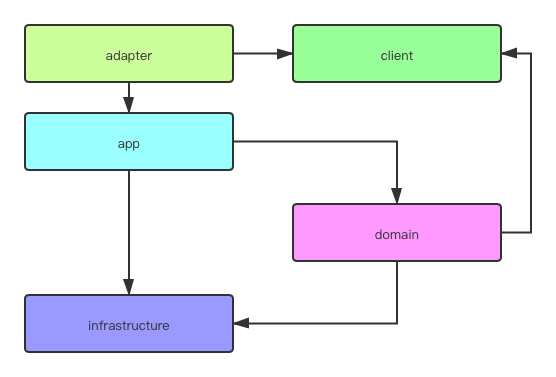

# DDD Sample go

大力借鉴了 [alibaba cola](https://github.com/alibaba/COLA) 的思想，在此致以感谢。

## 总体思路
* 面向离职编程：方便他人参与，方便他人接手
* 简单：方便不同层次开发者，清晰ddd各层
* 统一：命名与java版本尽量统一，方便不同语言开发者互相熟悉逻辑

## 设计：
1. CQRS  
读写分离
2. 使用interface完全解耦domain层  
domain层没有任何依赖
3. 使用自定义expection代替error  
应用异常按照golang推荐的方式，不使用panic
4. sql提取在配置中  
方便dba查看。如果sql比较复杂，带有条件判断，这里需要用到模版引擎
5. 数据层有独有的data object结构体  
解耦数据与传入传出的对象，增加开发工作量，但是结构更加清晰

## 文件夹介绍
1. cmd  
main及route
2. config  
配置、常量及配置中心初始化逻辑
3. internal  
所有业务逻辑
4. pkg  
"公共包"、工具类等

## 业务逻辑分层介绍：

1. client  
    * 常见的请求dto及输出dto，因为dto太过于通用，这里换成requestobject=RO，clientobject=CO  
    * 所有枚举包括异常枚举  
1. adapter：入口  
所有对内调用在一个入口，调用各种外部对象在一个出口，即是高内聚六边形架构。  
所以常见的调用方法-controller、mq、定时任务或命令行传参-都作为入口调用方放在adapter。  
1. app：命令  
按照cqrs原则分为command和query  
command即是事件风暴中的事件  
query即是事件风暴中的读模型  
1. domain  
    本层没有任何依赖
    - 领域层：按不同边界分开  
    - 域内服务 domain_service：实现了client中的接口，供外部调用  
    
    ---如果不熟悉ddd，可以从这里开始使用传统service的写法---  
    
    - 聚合根 aggregate：领域主入口，也是一个实体
    - 实体 entity：领域里的其他实体
    - 值对象 vo：属性对象
    - 防腐层 facade：这里缩减了防腐层及删除了repo，原因是当今微服务盛行，单个应用体积都不算太大，这里大多数内容都已经沉降在infrastructure中。这里只做接口
    - 事件 event：事件对象
    
    ---DDD和service究竟有什么样本质上的不同---  
    
    假如在一个service中吸收ddd的思想，也做好防腐层、事件驱动这些，是不是比DDD更优秀？（假DDD都是这么做的）  
    service有一些方面永远比不上DDD：
    * 没有固定的逻辑来区分对象，团队开发每个人写法都不同，接手困难
    * 复杂逻辑只能写在一起。在ddd中，每个对象相关逻辑是分布在每个对象的代码中的
    * 面向过程。没有模拟结构体来模拟真实逻辑
    
1. infrastructure  
基建：数据库及各种外部rpc，使用gateway作为入口  

## 不足：
因为没有引入IOC容器，domain需要在domain service中注入facade层的实现，不是非常优雅  
因为时间关系，很多地方没有处理nil

## 单元测试+覆盖率报告
go test -coverpkg=./... -coverprofile=coverage.data ./...   
go tool cover -func=coverage.data -o coverage.txt